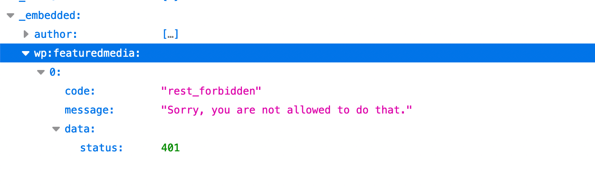
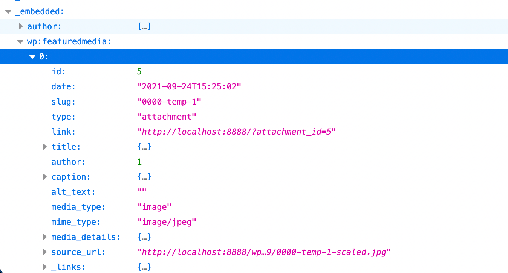

Unpublish Media Endpoint
======================

This plugin will enable media endpoint in case of the post it was uploaded from ( set as post parent ) is no longger in publish status, to fix issue of not able to use it in another post REST endpoint as featured image.

core ticket ref: https://core.trac.wordpress.org/ticket/41445

 > If media is uploaded for a post, then used as a featured image on another post, and the original parent is not accessible via the REST API (e.g. because it's in the trash, not published etc), then it cannot be embedded on the post that is accessible.

To reproduce issue:

1. Create a new post with a featured image.
2. Move the post to trash.
3. Create another post and use the image uploaded from the post moved to trash and attache it as featured image.
4. Check the response of this second post REST API with media embed enabled. ( i.e https://localhost/wp-json/wp/v2/posts/somePostID?_embed )
5. You will notice `rest_forbidden` error as per below screenshot.

Enable this plugin and notice the repose for step 4, you'll see expected media endpoint output:

